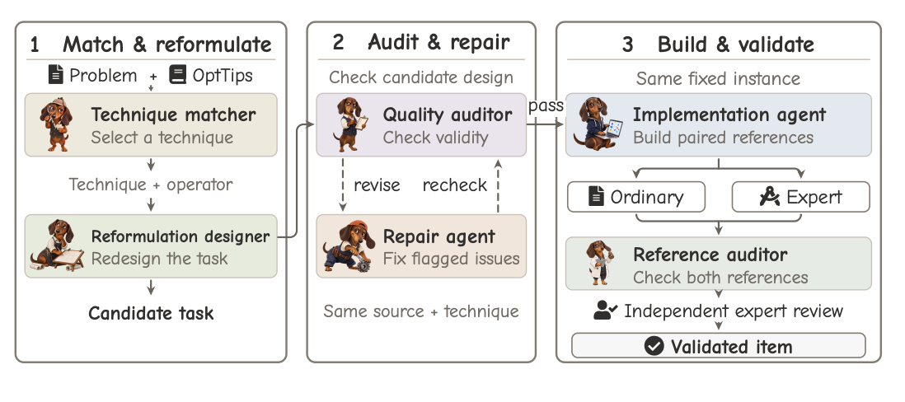
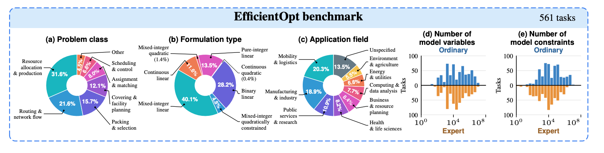

# EfficientOpt

**Right Answers, Costly Models: The Efficiency Gap in LLM-based Optimization Modeling**

[](https://arxiv.org/abs/2609.38884)
[](https://doi.org/10.5281/zenodo.23093476)
[](assets/OptTips.pdf)
[](#quick-start)

Zhong Li<sup>*</sup>, Xin Huang<sup>*</sup>, Jinhui Wan, Xiangyi Wang,
Shenkai Zhang, Ruiqi Chen, Wenyu Liu, Zaiwen Wen<sup>†</sup>, and Ziyan Luo<sup>†</sup>.

<sup>*</sup> Equal contribution. <sup>†</sup> Corresponding authors.

[Paper](https://arxiv.org/abs/2609.38884) · [Overview](#overview) · [Benchmark](#benchmark) · [Key Findings](#key-findings) · [Dataset](#dataset) · [Quick Start](#quick-start) · [Citation](#citation)

## Overview

**Correct answers can still be costly.** An LLM-generated optimization model can
return the right objective value while taking much longer to construct and solve.
EfficientOpt investigates this efficiency gap by comparing numerically correct
programs with ordinary and expert implementations on the same inputs. We examine
solver time, model preparation, memory, and the modeling choices behind these costs.

- **EfficientOpt:** 561 expert-reviewed tasks with ordinary and expert reference implementations on the same numerical instances.
- **OptTips:** 50 expert modeling techniques in eight families, covering applicability, inefficiency symptoms, modeling actions, and mathematical examples.
- **OptDachshund:** a six-agent workflow for technique matching, reformulation, auditing, repair, reference implementation, and validation.

[](assets/figures/optdachshund_pipeline.jpg)

Read the [OptTips cards](assets/OptTips.pdf) or explore the
[construction framework](construction/README.md).

## Benchmark

[](assets/figures/efficientopt_benchmark.jpg)

| Collection | Tasks | Technique groups | Purpose |
| --- | ---: | ---: | --- |
| Main benchmark | 561 | 29 | Paper evaluation |
| Supplemental pool | 63 | 21 | Additional technique coverage |
| OptTips knowledge base | — | 50 | Modeling guidance across eight families |

Tasks are constructed from problems in MAMO EasyLP/ComplexLP and OptMATH.
The supplemental pool is separate from the paper's main evaluation.
All 561 main tasks include verified reference objectives.

## Key Findings

Across 11 LLMs, the paper finds that:

- **Correct answers still leave an efficiency gap.** For every LLM, most correctly solved programs take longer to solve than their expert counterparts. All 11 models have lower aggregate solver time than ordinary references, but higher solver time than expert references.
- **A few slow cases dominate solver time.** For each model, the slowest approximately 10% of eligible correct runs consume **68.4%–76.2%** of total recorded solver time.
- **Smaller formulations are not necessarily faster.** Among correct programs with fewer variables and linear constraints than the expert reference in the comparable-size subset, **57.1% (181/317)** still take longer to solve.
- **Technique use and efficiency are distinct.** Case studies show that different modeling techniques can achieve the same optimal value at similar recorded cost; adopting the designated technique alone does not establish an efficiency gain.
- **Solving is only part of the cost.** Including model preparation reverses the LLM–expert speed comparison in **8.6% of 4,148 paired runs**. The paper also examines code-generation latency and memory use beyond solver time.

Cost analyses use numerically correct runs with the required measurements within
the **543-task reference-cost subset**. Each analysis uses the measurements it
requires; task sets can differ between models. See the paper for shared-task
comparisons and measurement details.

<details>
<summary><b>Computational costs by model</b></summary>

Ratios are **LLM/reference**; below 1 means lower LLM cost. These are the paper's
shifted geometric ratios (a one-second shift for time), not ratios of total time.
`Runtime` is Gurobi solver time; `Build+opt` includes recorded preparation and
separately timed solver calls.

| Model | Runtime / ordinary ↓ | Runtime / expert ↓ | Build+opt / expert ↓ |
| --- | ---: | ---: | ---: |
| Gemini 3.1 Pro | 0.52 | 1.68 | 1.43 |
| GPT-5.5 | 0.58 | 1.79 | 1.64 |
| Claude Opus 4.6 | 0.46 | 1.49 | 1.42 |
| DeepSeek-V4 Flash | 0.49 | 1.62 | 1.47 |
| Kimi K2.6 | 0.55 | 1.79 | 1.59 |
| Qwen 3.6 27B | 0.61 | 1.94 | 1.99 |
| GLM-5.1 | 0.50 | 1.68 | 1.44 |
| Qwen 3.5 122B | 0.55 | 1.82 | 1.73 |
| MiniMax M2.5 | 0.59 | 1.80 | 1.77 |
| Qwen 3 32B | 0.66 | 2.03 | 1.83 |
| Qwen 3.6 Plus | 0.52 | 1.83 | 1.63 |

All ratios within a row use the same correctly solved tasks with complete cost
measurements. These subsets differ between models, so this table compares each
LLM with its references rather than ranking LLMs on a shared task set.

Download [cost_ratios.csv](results/cost_ratios.csv), which also includes solver
work ratios, or browse [results/](results/README.md) for supplementary numerical
accuracy, task-level outcomes, and reference model sizes.

</details>

## Dataset

Browse [dataset/index.csv](dataset/index.csv) for instance IDs, splits, techniques,
paths, reference objectives, and instance hashes. Each task is self-contained:

```text
dataset/{main,supplemental}/Txx/Txx_nnn/
  problem.md
  instance.json
  ground_truth/
    ordinary_model.py
    technique_model.py
    ordinary_result.json
    technique_result.json
    metadata.json
    reference.json          # verified objective for main tasks
```

`technique_model.py` is the expert reference. For candidate generation, provide
the problem statement and input-field descriptions; the generated code receives
the numerical instance at execution. Keep `ground_truth/`, target-technique
labels, and technique-coded directory names outside the model prompt.

All **624 numerical instances** (561 main and 63 supplemental) are distributed
together in `EfficientOpt-data.zip`, approximately **1.76 GB** compressed and
**7.52 GB** after extraction. The archive preserves the `dataset/` layout above.
This repository contains the problem statements, reference implementations, and
results; the numerical instances are downloaded separately.

**Data download:** [Zenodo record](https://doi.org/10.5281/zenodo.23093476) ·
[Download EfficientOpt-data.zip](https://zenodo.org/records/23093476/files/EfficientOpt-data.zip?download=1).
See [dataset/README.md](dataset/README.md) for archive contents and extraction
instructions.

## Quick Start

```bash
git clone https://github.com/ZhongLIFR/EfficientOpt.git
cd EfficientOpt
```

Download and extract the numerical instances from the repository root:

```bash
curl -L --fail "https://zenodo.org/records/23093476/files/EfficientOpt-data.zip?download=1" -o EfficientOpt-data.zip
unzip -n EfficientOpt-data.zip
```

This places each `instance.json` beside its `problem.md`, under
`dataset/main/` or `dataset/supplemental/`. No Git LFS setup is required.

Check the included example's recorded result against its verified objective:

```bash
python evaluate.py --instance T01_002 \
  --result dataset/main/T01/T01_002/ground_truth/ordinary_result.json
```

This is a local numerical check and does **not** require Gurobi or an API key.
To execute a reference or your own candidate, install the solver dependencies:

```bash
python -m pip install -r requirements.txt
python evaluate.py --instance T01_002 --reference expert
python evaluate.py --instance T01_002 --candidate path/to/candidate.py
```

Gurobi-based execution requires a suitable Gurobi license. See
[evaluation/README.md](evaluation/README.md) for candidate interfaces and
`judge.py` usage, and [construction/README.md](construction/README.md) for
OptDachshund commands. Numerical agreement checks the recorded objective;
technique-use judgments and computational costs are reported separately.

## Citation

Please cite the paper when using EfficientOpt, OptTips, or OptDachshund.
Download [citation.bib](citation.bib).

```bibtex
@misc{li2026efficientopt,
  title={Right Answers, Costly Models: The Efficiency Gap in {LLM}-based Optimization Modeling},
  author={Li, Zhong and Huang, Xin and Wan, Jinhui and Wang, Xiangyi and Zhang, Shenkai and Chen, Ruiqi and Liu, Wenyu and Wen, Zaiwen and Luo, Ziyan},
  year={2026},
  eprint={2609.38884},
  archivePrefix={arXiv},
  primaryClass={cs.LG},
  url={https://arxiv.org/abs/2609.38884}
}
```

## Contact

Zaiwen Wen: [wenzw@pku.edu.cn](mailto:wenzw@pku.edu.cn) ·
Ziyan Luo: [zyluo@bjtu.edu.cn](mailto:zyluo@bjtu.edu.cn)
